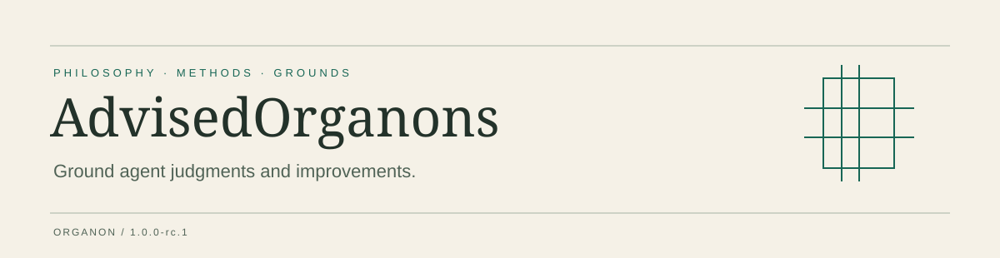

[English](README.md) · [简体中文](zh/README.md) · [Website](https://shendeguize.github.io/AdvisedOrganons/) · [Releases](https://github.com/shendeguize/AdvisedOrganons/releases)

# AdvisedOrganons

Domain philosophies with explicit boundaries.

## Design Aim · Ground agent judgments and improvements

Make commitments, reasons and boundaries readable, assessable and revisable. Organon supplies philosophy and methods; it does not promise correct judgments or automatic improvement. Philosophical adoption retains an explicit human decision.

The current domain is **SoftwareEngineering**. Philosophy **0.2.1** adds a defeasible priority for credible software evolution and retains the considered Core **0.1.2** checkpoint. That priority is an additional commitment, not a deduction from the Core. Selecting this domain remains explicit.

## Start here

```sh
npx --yes @shendeguize/agent-organon@1.0.0-rc.1 install --product advised --agent codex --scope project --project /path/to/workspace --version 1.0.0-rc.1 --domain SoftwareEngineering
```

Release candidate **1.0.0-rc.1** awaits review. Run this command once the public package is available; before publication use a local candidate archive. Requires Node.js 22+. Project and global installation are available; the release matrix records actual validation for the six agent adapters.

[Complete quick start: install → check → select philosophy → read-only assessment](https://shendeguize.github.io/AdvisedOrganons/quick-start)

## Read and navigate

| Entry | Content |
| --- | --- |
| [AgentOrganon](https://github.com/shendeguize/AgentOrganon) | Workspace skills and management of adopted copies. |
| [OrganonCore](https://github.com/shendeguize/OrganonCore) | Core philosophy, review methods and Lean evidence. |
| [AdvisedOrganons](https://github.com/shendeguize/AdvisedOrganons) | Domain philosophy collection; select a domain explicitly. |
| [Docs](https://shendeguize.github.io/AdvisedOrganons/understand) | Concepts, operations and capability boundaries for readers. |
| [Philosophy](https://shendeguize.github.io/AdvisedOrganons/philosophy) | Adopted commitments with their meanings and conditions. |
| [Lean](https://shendeguize.github.io/AdvisedOrganons/lean) | Claim overviews and paired code with line explanations. |

Release packages contain philosophy, non-Lean skills and required runtime files. Websites, tutorials, Lean projects and evidence remain in source. Rationale is separate from reader documentation and adds no philosophical obligations; maintenance protocols live in maintenance.


## Choose a method

| Discovered entrypoint | Purpose |
| --- | --- |
| `organon-software-engineering` | Route assessment under a selected philosophy; also support wording-only review. |

Before assessment, explicitly select the domain and adopted philosophy path, then use this domain entrypoint to reach the bundled workspace and Core review methods. The package includes the required implementations but does not separately register the four Core method names as discoverable skills. Installing the domain entrypoint does not adopt its philosophy; a wording-only request does not require a philosophy selection.

## Star history


Daily observations begin when collection is enabled. Zero totals, unstars and missing samples are retained; the chart reports its update time.

## Contribute

Read the repository’s agent guidance and maintenance protocols before contributing. Mechanical checks, independent review and human adoption decisions have distinct responsibilities.

MIT · [License](LICENSE)
